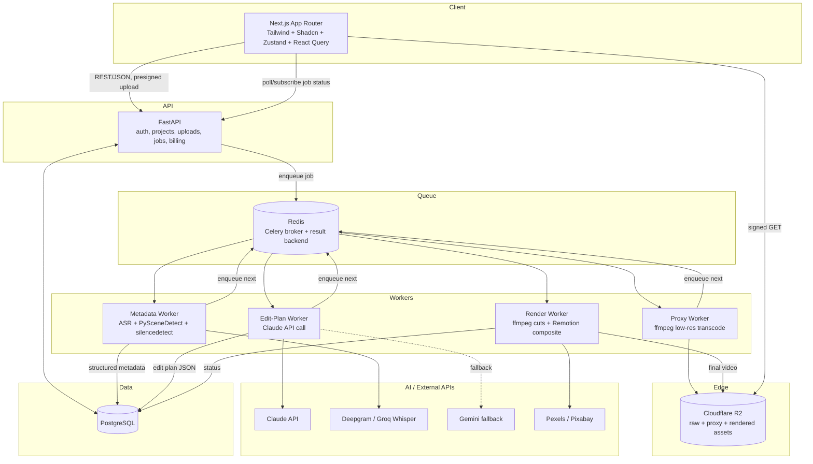

# ViralCut AI — System Architecture

See [ADR 0001](adr/0001-asr-provider.md), [0002](adr/0002-orm-choice.md),
[0003](adr/0003-video-stack-scope.md), [0004](adr/0004-metadata-extraction-scope.md)
for the deviations from the original spec baked into this document.

## High-level component diagram

## Pipeline (matches spec's 7 steps, with scope trimmed per ADR-0004)

1. **Upload** — client requests a presigned R2 upload URL from FastAPI, uploads
   directly to R2 (never proxied through the API process).
2. **Proxy generation** — Celery task transcodes a low-res (480p) proxy for fast
   preview/editing in the timeline UI.
3. **Metadata extraction** — transcript (word timestamps + diarization) via
   hosted ASR, scene changes via PySceneDetect, silence windows via ffmpeg.
   No face/emotion/object detection in Phase 1 (ADR-0004).
4. **Structured metadata assembly** — normalize all of the above into one JSON
   document per source video, stored in Postgres (`metadata` table).
5. **Claude edit-plan generation** — Claude receives *only* the structured
   metadata JSON + style preset + user instructions. It never sees raw video
   or pixels. Output is validated against a strict JSON schema and clamped to
   actual media duration before being trusted (Claude will occasionally
   hallucinate an out-of-range timestamp — validate, don't assume).
6. **Render** — Render worker executes the edit plan: ffmpeg does cuts/silence
   removal/concat on the source, then Remotion composites captions, zooms,
   transitions, motion graphics, and B-roll on top, and renders the final
   deliverable.
7. **Export/delivery** — final file lands in R2, signed URL returned to client,
   job marked complete.

## Why Celery + Redis (not SQS/Temporal/etc.)

Kept as-is from spec. For a solo founder, Celery+Redis is one Docker service,
well-documented, and sufficient at MVP-to-early-growth scale. Revisit only if
you need cross-region workers or exactly-once semantics that Celery's
at-least-once model doesn't give you — not a Phase 1 or Phase 2 problem.

## Render worker is a two-language process — call this out explicitly

FFmpeg orchestration is Python (subprocess calls). Remotion rendering is a
Node.js process (`@remotion/renderer`). The render worker container runs both
runtimes. This is the one place in the stack where "just Python" breaks down,
because Remotion (React-based, deterministic, designed for this exact
captions/motion-graphics use case) is a materially better tool than trying to
hand-roll the same visuals in ffmpeg filter graphs. Document this clearly so
it isn't a surprise during Phase 1 implementation — it's a deliberate
trade-off, not scope creep.

## Cost-sensitive defaults

- All workers are **CPU-only** instances. No GPU in the critical path for MVP
  or Phase 2 (see ADR-0001, ADR-0004).
- Proxies are low-res so editing/preview never touches full-res footage.
- Assets (transitions, sound effects, music, motion graphics templates) are
  rendered/fetched once and cached in R2, keyed by a content hash — never
  regenerated per-project.
- Claude calls use prompt caching on the (large, mostly-static) system prompt
  / style-preset rules block; only the per-video metadata + instructions vary.
